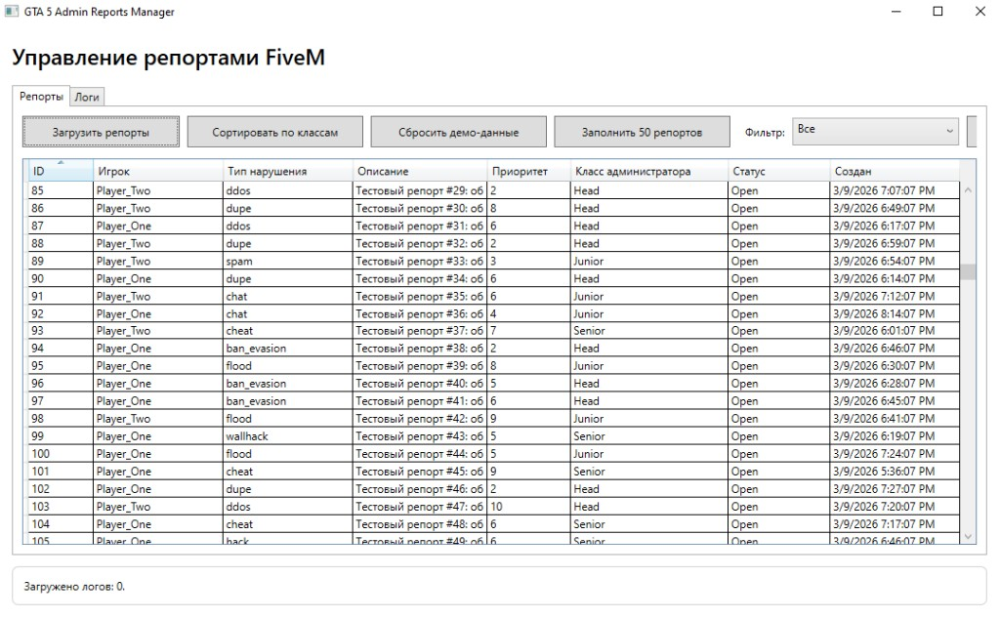
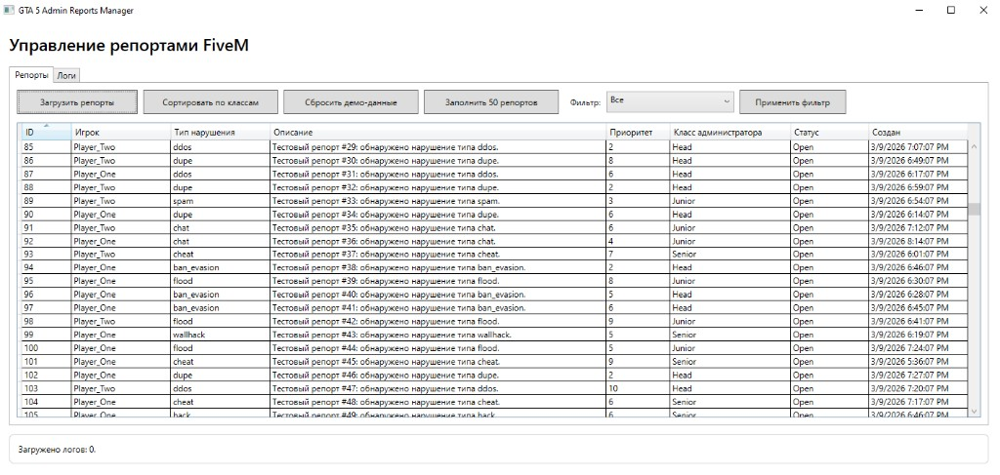
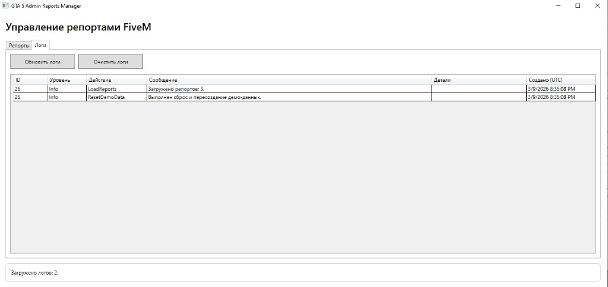

# GTA Admin Reports App

Настольное приложение для администрирования сервера GTA 5 (FiveM) с автоматической сортировкой репортов по классам администрации и журналированием действий в PostgreSQL.

## Ключевые возможности

- автоматическая классификация репортов: `Junior` / `Senior` / `Head`;
- загрузка и фильтрация списка репортов;
- генерация демо-данных (`+50` репортов);
- вкладка логов с просмотром и очисткой журнала;
- хранение данных и логов в PostgreSQL через Entity Framework Core.

## Демо

> Добавь файлы в `docs/media/`, и блоки ниже начнут отображать реальные медиа.

### GIF-демо


### Скриншоты

| Экран | Превью |
|---|---|
| Вкладка репортов |  |
| Результат сортировки |  |
| Вкладка логов |  |

## Технологический стек

- C# / .NET 8
- WPF
- Entity Framework Core 8
- PostgreSQL
- Npgsql

## Архитектура

- `Data/AppDbContext.cs` — EF Core контекст и mapping таблиц;
- `Models/Report.cs`, `Models/User.cs`, `Models/AppLog.cs` — сущности;
- `Services/ReportClassifierService.cs` — правила классификации нарушений;
- `Services/ReportService.cs` — операции с репортами;
- `Services/AppLoggerService.cs` — запись/чтение логов;
- `ViewModels/MainWindowViewModel.cs` — бизнес-логика UI;
- `MainWindow.xaml` — интерфейс с вкладками `Репорты` и `Логи`.

## Правила сортировки

- `chat`, `flood`, `spam`, `insult` -> `Junior`
- `cheat`, `hack`, `aimbot`, `wallhack` -> `Senior`
- `ban_evasion`, `ddos`, `exploit`, `dupe` -> `Head`
- fallback по `Priority`:
  - `>= 8` -> `Head`
  - `>= 5` -> `Senior`
  - иначе -> `Junior`

## Быстрый запуск

1. Установить PostgreSQL и создать БД (например, `gta_admin_db`).
2. Настроить строку подключения в `appsettings.json`.
3. Выполнить:

```powershell
dotnet restore
dotnet run
```

Пример подключения:

```json
{
  "ConnectionStrings": {
    "PostgresDatabase": "Host=127.0.0.1;Port=5432;Database=gta_admin_db;Username=postgres;Password=CHANGE_ME;"
  }
}
```

## Проверка работы

1. `Сбросить демо-данные`
2. `Заполнить 50 репортов`
3. `Сортировать по классам`
4. Вкладка `Логи` -> `Обновить логи`

## Документация

- Полная инструкция установки: `INSTALL.md`
- SQL-скрипт: `sql-init.sql`
- Папка для медиа в README: `docs/media/README_MEDIA.md`

## Публикация .exe

```powershell
dotnet publish -c Release -r win-x64 --self-contained false
```

Готовая сборка:
`bin/Release/net8.0-windows/win-x64/publish/GtaAdminReportsApp.exe`
